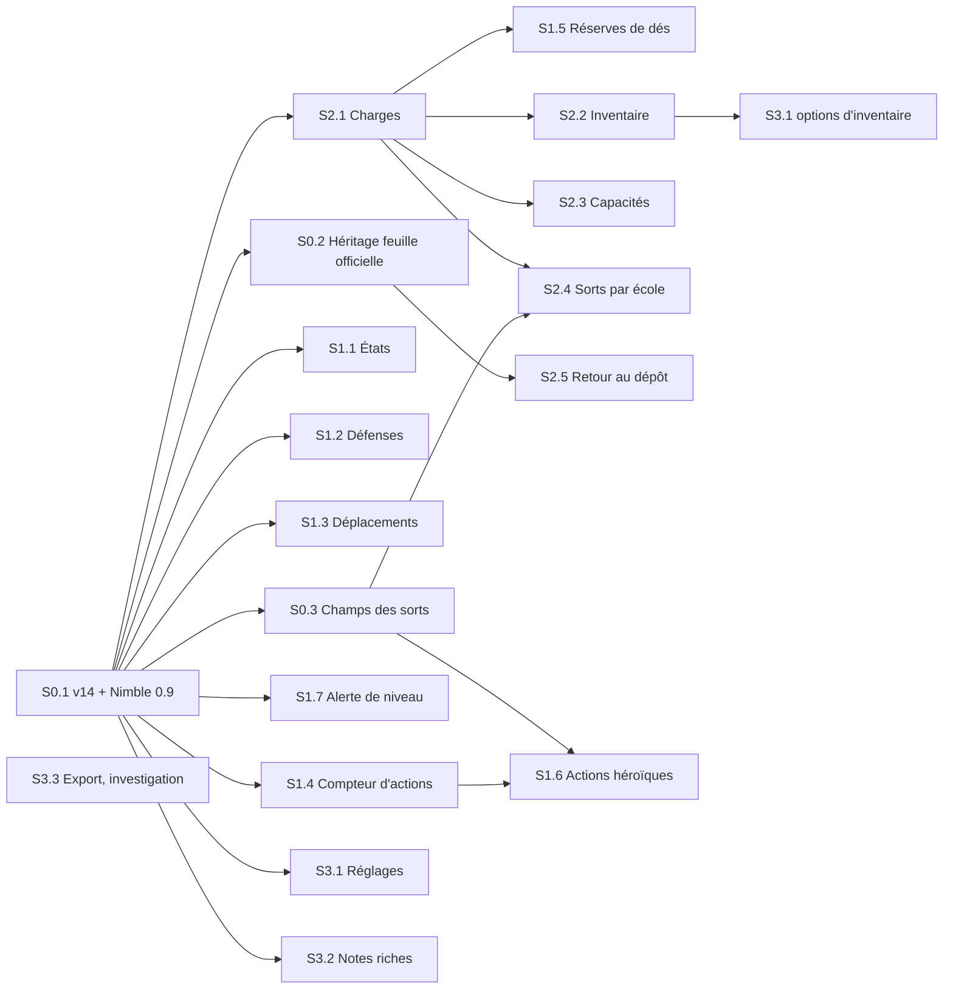

# Parité avec la feuille officielle Nimble — plan en stories

Date : 2026-10-01 · Module : nimble-white-sheet-dev 0.9.10 · Référence : système Nimble 0.9.0
(`/home/ricco/Projets/Nimble/FoundryVTT-Nimble`, `src/view/sheets/PlayerCharacterSheet.svelte` et `pages/`)

## Constats

- **Bloquant** : le système Nimble 0.9.0 exige Foundry **v14** (`compatibility.minimum: 14`). Le module
  est limité à v13 (`module.json` `maximum: "13"`, types `fvtt-types` v13). Avec le système actuel,
  la feuille n'est pas utilisable.
- **Bug** : l'onglet Sorts lit des champs absents du système 0.9 :

  | Lu par la feuille | Champ réel du système 0.9 |
  |---|---|
  | `system.concentration` | `system.properties.selected` contient `concentration` |
  | `system.isUtility` | `system.properties.selected` contient `utilitySpell` |
  | `system.activationCost` | `system.activation.cost` (`{ type, quantity, isReaction }`) |

  Les tags [C]/[U] ne s'affichent jamais, les sorts utilitaires ne sont pas regroupés et le coût reste vide.
- Le système expose `game.nimble.applications.PlayerCharacterSheet` (la classe de la feuille officielle)
  et `game.nimble.macros.activateHeroicActionMacro(actionId, actionType)`. Ses composants Svelte et ses
  utilitaires internes (charges, règles, info-bulles, export PDF) ne sont **pas** exposés.

## Fonctionnalités absentes de la feuille blanche

| # | Fonctionnalité officielle | Story |
|---|---|---|
| 1 | Onglet Actions héroïques (attaque, sort, évaluation, déplacement, frappe à mains nues ; réactions défense, interposition, aide, opportunité, personnalisées) | S1.6 |
| 2 | Compteur d'actions en combat, réserves de dés de classe | S1.4, S1.5 |
| 3 | Onglet États (conditions) | S1.1 |
| 4 | Défenses aux dégâts (résistances, immunités…) | S1.2 |
| 5 | Modes de déplacement vol / escalade / nage / fouissement | S1.3 |
| 6 | Alerte de niveau incomplet + correction | S1.7 |
| 7 | Initiative déjà lancée signalée | S1.4 |
| 8 | Charges sur les items | S2.1 |
| 9 | Inventaire : équiper, regroupement par type, tri glisser-déposer, dépassement d'emplacements, emplacements bonus, poids de la monnaie | S2.2 |
| 10 | Capacités groupées sous classe / sous-classe / ascendance, tri par niveau, repliables, recherche, création, envoi au chat | S2.3 |
| 11 | Sorts par école (onglets + icône), libellé de coût, info-bulles détaillées | S2.4 |
| 12 | Dépôt : sort → apprendre ou parchemin, clignotement, bascule d'onglet | S0.2, S2.5 |
| 13 | Onglet Réglages (cadrage du portrait, macros auto, images, compétences 2 colonnes, scores passifs, palier de sort max, options d'inventaire) | S3.1 |
| 14 | Export PDF / JSON | S3.3 |
| 15 | Éditeur de notes riche (ProseMirror) | S3.2 |

Propres à la feuille blanche (à conserver) : mise en page papier, 4 thèmes dont Custom (15 couleurs),
barre latérale des armes, support Tokenizer, confirmation de suppression.

## Choix d'approche

Convertir la feuille officielle n'est **pas** plus simple : ses composants dépendent de centaines de
modules internes non exposés, il faudrait recopier une grande partie du système et la resynchroniser à
chaque version.

| Approche | Effort | Fonctionnalités | Mise en page papier | Suivi du système |
|---|---|---|---|---|
| A. Reskin CSS de la feuille officielle (héritage + thème) | Faible | 100 % d'emblée | Partielle (limites du CSS) | Automatique |
| B. Tout porter dans la feuille blanche | Très élevé | Ce qui est réécrit | Totale | Manuel, fragile |
| **C. Hybride (retenue)** | Moyen | Progressif | Totale | Partiel |

**C** : la feuille hérite de la classe officielle (dépôt, parchemins, sous-classes, correction de niveau,
tri gratuits), garde sa mise en page Svelte, et réécrit l'interface manquante en s'appuyant sur les API
publiques : méthodes de l'acteur, `game.nimble.macros`, `CONFIG.NIMBLE`, `actor.toggleStatusEffect`.
Si la mise en page papier devient négociable, A coûte dix fois moins.

## Dépendances et parallélisation

| Vague | Stories (parallélisables entre elles) | Prérequis de la vague |
|---|---|---|
| 0 | **S0.1** ; en parallèle l'investigation **S3.3** (lecture du code du système seulement) | — |
| 1 | S0.2, S0.3, S1.1, S1.2, S1.3, S1.4, S1.7, **S2.1**, S3.1 (hors options d'inventaire), S3.2 | S0.1 |
| 2 | S1.5, S2.2, S2.3, S2.4, S2.5, S1.6 | voir colonne « Dépend de » |
| 3 | S3.1 options d'inventaire | S2.2 |

Chemin critique : **S0.1 → S0.3 + S1.4 → S1.6** (actions héroïques, la plus grosse story).
Dans la vague 1, prioriser **S2.1** : elle débloque quatre stories de la vague 2.

Zones de conflit si plusieurs stories avancent en même temps (mêmes fichiers) :

| Fichier | Stories qui le modifient | Conseil |
|---|---|---|
| `components/ItemRow.svelte` | S2.1, S2.2, S2.3, S2.4 | S2.1 d'abord (ajoute l'emplacement des charges), puis les autres |
| `sections/StatsRow.svelte` | S1.2, S1.3, S1.4, S1.5 | une story à la fois, ou découper StatsRow avant |
| `sections/ContentArea.svelte` (onglets) | S1.1, S1.6, S3.1 | ajouter d'abord un tableau d'onglets extensible (fait dans la première des trois) |
| `WhiteSheet.svelte`, `HeaderRow.svelte` | S0.2, S1.4, S1.7 | S0.2 avant S1.4 et S1.7 |
| `sheets/WhiteCharacterSheet.svelte.ts` | S0.1, S0.2 | séquentiel (déjà imposé par la dépendance) |

## Stories

Tailles : **S** ≈ ½ jour, **M** 1–2 jours, **L** 3 jours et plus.

### Epic 0 — Fondations (bloque tout le reste)

#### S0.1 — Compatibilité Foundry v14 et Nimble 0.9 · L · Dépend de : —
En tant que MJ, je veux que la feuille fonctionne avec Foundry v14 et Nimble 0.9, afin de l'utiliser
avec la version actuelle du système.
- Types `fvtt-types` v14 ; `module.json` `minimum: 14`, système `>= 0.9.0`.
- `_onDropItem` adapté à la signature v14 (le système documente l'écart dans
  `src/documents/sheets/PlayerCharacterSheet.svelte.ts`).
- `npm run check` sans erreur ; la feuille s'ouvre dans un monde v14 et toutes les fonctions actuelles
  marchent (jets, configuration, onglets, thèmes, repos, montée de niveau).
- `/release` : vérifier que la validation accepte la nouvelle compatibilité.

#### S0.2 — Hériter de la feuille officielle (spike puis implémentation) · M · Dépend de : S0.1
En tant que développeur, je veux que la feuille hérite de `game.nimble.applications.PlayerCharacterSheet`,
afin de profiter de la logique de dépôt et des actions du système.
- Classe construite au hook `init` (après le système) ; le mixin Svelte du module est conservé, car deux
  runtimes Svelte ne peuvent pas se mélanger.
- Le `_onDropItem` dupliqué du module est supprimé.
- Déposer un sort propose « apprendre ou parchemin » ; la validation des sous-classes fonctionne.
- Sortie de secours : si l'héritage casse le rendu, rester sur `ActorSheetV2` et n'appeler que les API.

#### S0.3 — Corriger les champs des sorts · S · Dépend de : S0.1 (pour tester sur un monde 0.9)
En tant que joueur, je veux voir les tags concentration / utilitaire et le coût d'activation de mes sorts,
afin de savoir comment les lancer.
- Lecture de `properties.selected` et `activation.cost`.
- Sorts utilitaires regroupés en palier 0, comme la feuille officielle.

### Epic 1 — Combat · Dépend de : Epic 0 (S0.1 pour tout ; S0.3 pour S1.6)

#### S1.1 — Onglet États · S · Dépend de : S0.1
En tant que joueur, je veux activer et désactiver mes conditions depuis la feuille, afin de suivre mon
état sans passer par le token.
- Liste depuis `CONFIG.statusEffects`, bascule via `actor.toggleStatusEffect`.

#### S1.2 — Défenses aux dégâts · S · Dépend de : S0.1
En tant que joueur, je veux voir et configurer mes résistances et immunités, afin de les appliquer en combat.
- Affichage groupé ; configuration via `actor.configureDamageDefenses()`.

#### S1.3 — Modes de déplacement · S · Dépend de : S0.1
En tant que joueur, je veux voir mes vitesses de vol, d'escalade, de nage et de fouissement, afin de
connaître toutes mes options de mouvement.
- Seuls les modes supérieurs à 0 s'affichent, à côté de la marche.

#### S1.4 — Compteur d'actions et initiative · M · Dépend de : S0.1
En tant que joueur, je veux voir mes actions restantes pendant mon tour, afin de ne pas en dépenser plus
que permis.
- Visible uniquement en combat ; l'initiative déjà lancée est signalée.

#### S1.5 — Réserves de dés de classe · M · Dépend de : S2.1
En tant que joueur, je veux voir et dépenser mes réserves de dés de classe, afin de gérer cette ressource
sans quitter la feuille.
- Seules les réserves avec une taille de dé ; les autres sont des charges (S2.1, qui fournit la lecture
  des réserves).

#### S1.6 — Actions héroïques · L · Dépend de : S0.3, S1.4
En tant que joueur, je veux déclencher mes actions et réactions héroïques depuis la feuille, afin de jouer
mon tour sans macros. Remplace la spec `2026-03-28-heroic-actions-sidebar`.
- Déplacement, frappe à mains nues, réactions et opportunité via
  `game.nimble.macros.activateHeroicActionMacro`.
- Panneaux propres pour attaque (armes), sort (sorts, d'où S0.3) et évaluation.
- La feuille réagit à `$state.activePrimaryTab = 'actions'` (utilisé par les macros de la barre).
- Décision préalable : remplacer la barre des armes ou ajouter un onglet.

#### S1.7 — Alerte de niveau incomplet · S · Dépend de : S0.1
En tant que joueur, je veux être prévenu quand un choix de niveau manque, afin de terminer mon personnage.
- Bandeau dans l'en-tête qui appelle `actor.triggerLevelCorrection()`.

### Epic 2 — Items · Dépend de : S0.1, puis S2.1 pour S2.2–S2.4

#### S2.1 — Charges sur les items · M · Dépend de : S0.1
En tant que joueur, je veux voir les charges restantes de mes capacités et objets, afin de savoir ce que
je peux encore utiliser.
- Pastilles / compteur dans `ItemRow` (crée l'emplacement réutilisé par S2.2–S2.4).
- Source des données à confirmer : les réserves partagées sont gérées par du code interne du système.

#### S2.2 — Inventaire complet · M · Dépend de : S2.1
En tant que joueur, je veux équiper mes objets et les voir rangés par type, afin d'organiser mon inventaire.
- Bouton équiper / déséquiper, regroupement par type, tri par glisser-déposer.
- Alerte de dépassement d'emplacements.

#### S2.3 — Capacités organisées · M · Dépend de : S2.1
En tant que joueur, je veux mes capacités rangées sous ma classe, ma sous-classe et mon ascendance, afin
de m'y retrouver quand la liste s'allonge.
- Tri par niveau d'obtention, cartes repliables + « tout déplier ».
- Recherche, création, envoi dans le chat.

#### S2.4 — Sorts par école · M · Dépend de : S0.3, S2.1
En tant que lanceur de sorts, je veux filtrer mes sorts par école, afin de trouver vite le bon sort.
- Onglets par école avec icône ; info-bulles détaillées (effet, effet à plus haut niveau).

#### S2.5 — Retour visuel au dépôt · S · Dépend de : S0.2
En tant que joueur, je veux voir où atterrit l'item que je dépose, afin de vérifier qu'il a été ajouté.
- Bascule sur le bon onglet et clignotement de l'item (en partie hérité via S0.2).

### Epic 3 — Réglages et confort · Dépend de : S0.1

#### S3.1 — Onglet Réglages · M · Dépend de : S0.1 ; options d'inventaire : S2.2
En tant que joueur, je veux régler l'affichage de ma feuille, afin de l'adapter à ma façon de jouer.
- Cadrage du portrait, compétences sur deux colonnes, scores passifs, macros automatiques, palier de sort
  max ; options d'inventaire après S2.2.
- Mêmes flags que la feuille officielle, pour partager les réglages entre les deux feuilles.

#### S3.2 — Éditeur de notes riche · S · Dépend de : S0.1
En tant que joueur, je veux mettre en forme mes notes, afin d'y garder des informations lisibles.
- Élément `<prose-mirror>` de Foundry (renforce aussi la protection contre le XSS).

#### S3.3 — Export PDF / JSON · S–M · Dépend de : — (investigation) ; S0.1 pour l'implémentation
En tant que joueur, je veux exporter mon personnage, afin de le garder ou de l'imprimer.
- D'abord vérifier si le système expose ces fonctions ; sinon, abandonner ou demander l'exposition au
  système.
